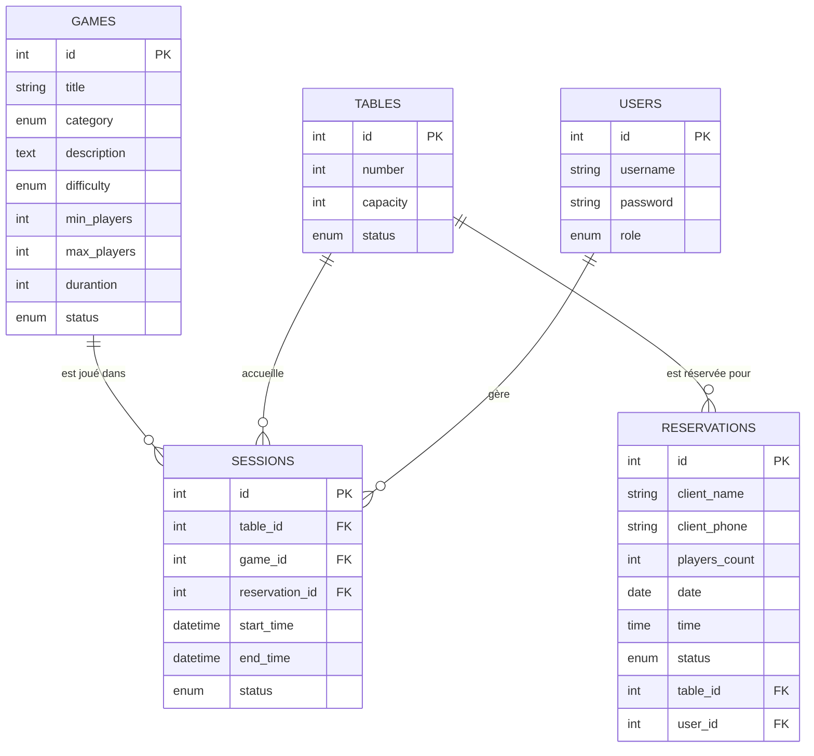
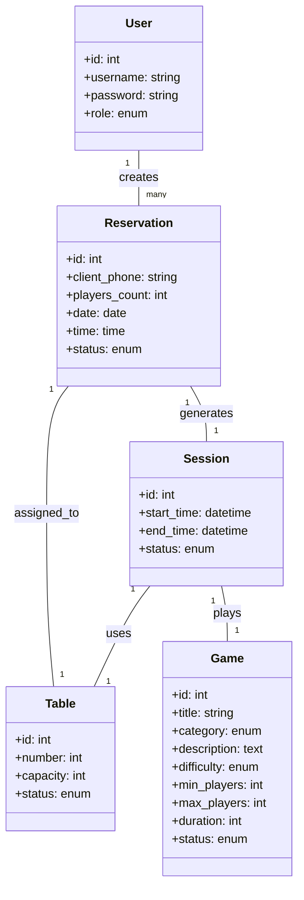
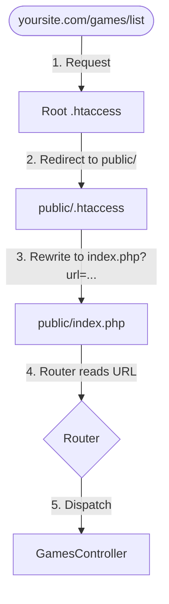

# 🎲 Aji L3bo Café — Projet PHP MVC

Application web professionnelle de gestion pour un café de jeux de société ("Aji L3bo"). Ce projet implémente une architecture MVC robuste, un routage personnalisé et une gestion complète de base de données sans dépendances JavaScript, privilégiant une logique serveur pure.

---

## 🚀 Fonctionnalités Clés

- **Catalogue Dynamique** : Visualisation complète des jeux avec filtrage par catégorie.
- **Système de Réservation** : Gestion des disponibilités des tables en temps réel.
- **Suivi des Sessions** : Contrôle du temps de jeu (Démarrage/Arrêt) avec calcul des durées.
- **Administration Centralisée** : CRUD complet pour les jeux et monitoring des réservations/sessions.
- **Architecture de Test** : Environnement de tests unitaires et d'intégration intégré.

---

## 🏗️ Architecture & Conception 

### 📊 erDiagram using mermaid

Le système repose sur quatre entités principales interconnectées.



### 📋 My data tables

1.  **GAMES** (**id**, title, category, description, difficulty, min_players, max_players, duration, status)
2.  **TABLES** (**id**, number , capacity, status)
3.  **RESERVATIONS** (**id**, users_id, client_phone, players_count, date, time, status,  table_id, )
4.  **SESSIONS** (**id**, start_time, end_time, status, reservation_id, game_id, table_id)
5.  **USERS** (**id**, username, password, role)

### 🗺️ classDiagram using mermaid



---

### 🔄 Routing Flow

Visualisation du cycle de vie d'une requête, de l'URL jusqu'au contrôleur :



---

## 🗄️ Structure de la Base de Données

| Table | Description |
|-------|-------------|
| `games` | Catalogue des jeux de société disponibles au café. |
| `tables` | Les tables physiques du café avec leur capacité d'accueil. |
| `reservations` | Les créneaux réservés par les clients externes. |
| `sessions` | Les parties en cours, liant une table à un jeu spécifique. |
| `users` | Comptes administrateurs pour la gestion du back-office. |

---

## 📂 Structure du Projet (MVC)

```bash
aji_nl3bou/
├── config/             # Configuration de l'application (db.php, settings.php)
├── database/           # Scripts SQL de la base de données
│   ├── schema.sql      # Définition des tables (MCD/MLD)
│   └── seed.sql        # Données de test et initialisation (Seeders)
├── public/             # Point d'entrée (index.php) et Assets (CSS/Img)
├── src/                # Logique métier
│   ├── Controllers/    # Gestion des requêtes (Controllers)
│   ├── Models/         # Interaction Base de Données (Entities & Repositories)
│   └── Core/           # Router, BaseController et Database Wrapper
├── views/              # Fichiers PHP/HTML (Templates)
├── tests/              # Tests Unitaires et d'Intégration
├── taskboard.md        # Suivi du projet (ScrumBan/Agile)
└── composer.json       # Autoloading PSR-4 et dépendances
```

---

## 🛠️ Installation & Setup

1.  **Clone & Install** :
    ```bash
    git clone https://github.com/Ayouub-aj/Aji_nl3bou.git
    composer install
    ```
2.  **Database Config** : 
    - Importer `config/database.sql`.
    - Configurer `config/database.php` avec vos credentials.
3.  **Run Server** :
    ```bash
    php -S localhost:8000 -t public
    ```

---

## 🧪 Stratégie de Test

Le projet utilise une approche de test hybride :
1.  **Unit Tests** : Validation des modèles dans `tests/GameTest.php` etc.
2.  **Integration Tests** : Vérification du routage dans `tests/RouteTest.php`.
3.  **Security Audit** : Tests de non-régression sur les injections SQL et XSS.

---

## 📄 Licence
Distribué sous licence APACHE 2.0 voir `LICENSE` pour plus d'informations.